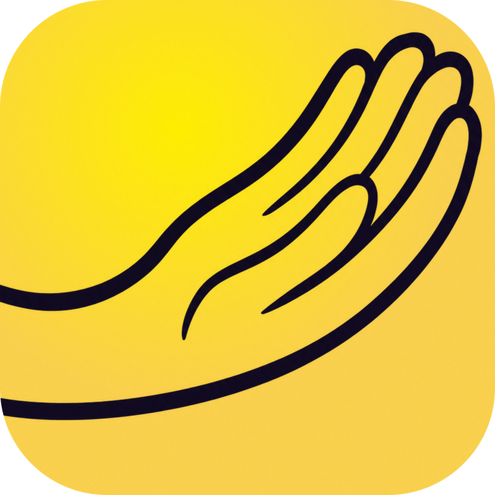
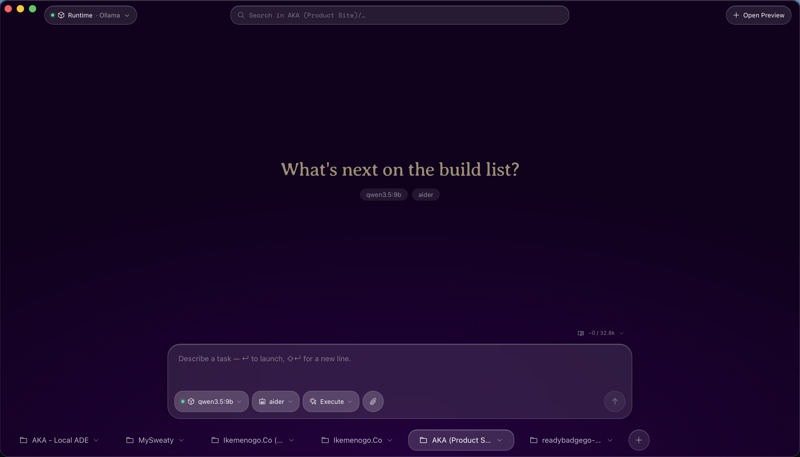
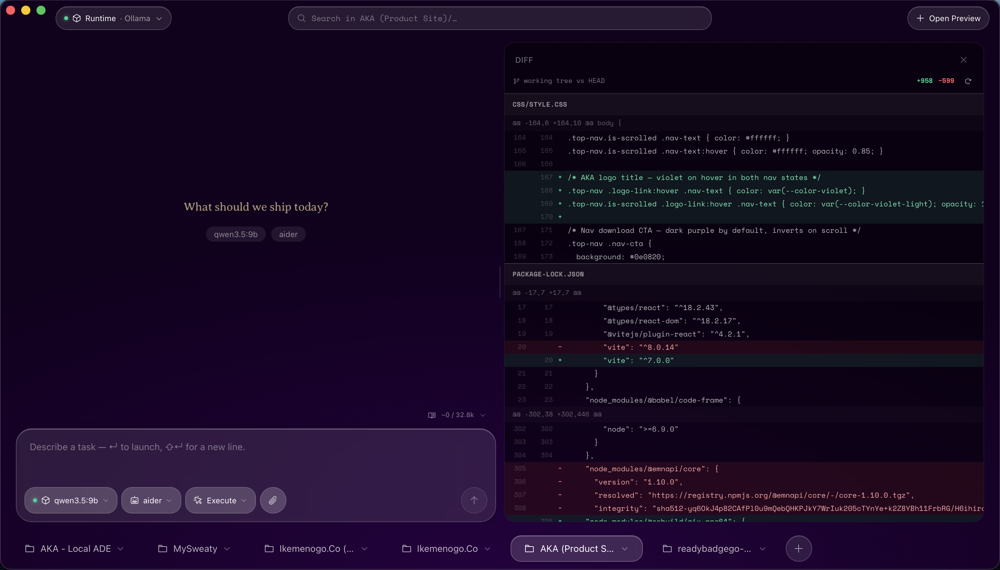
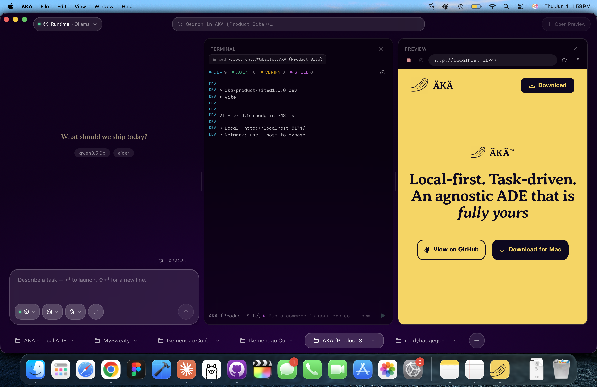
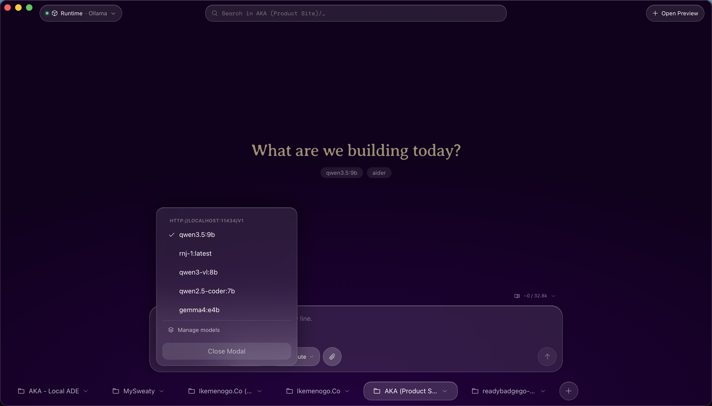

<p align="center">
  
</p>

<h1 align="center">ÄKÄ</h1>

<p align="center">
  <strong>Local-first. Task-driven. An agnostic ADE that is fully yours.</strong><br />
  Bring any model. Bring any agent. ÄKÄ orchestrates them.
</p>

<p align="center">
  
  
  
  
</p>

---

> **ÄKÄ is in active early development.** Core workflows are functional, but expect rough edges. Every contribution and piece of feedback shapes where this goes next.

---

## What ÄKÄ is

ÄKÄ is a desktop **work-dispatch environment** for coding agents — not a chat app, not a wrapper. You describe a task, choose a model and an agent, launch it, then review the diff and decide what ships.

It runs entirely on your machine. Your code stays yours.

ÄKÄ is **fully agnostic by design**: you bring your own LLM backend (Ollama, MLX, LM Studio, any OpenAI-compatible endpoint) and your own agent (Aider, OpenCode, a LangChain script, a custom binary — anything). ÄKÄ never bundles a model or prescribes an agent. Every integration is a user-defined record treated identically at runtime.

---

## Screenshots

| Task Workspace | Diff Viewer |
|---|---|
|  |  |

| Terminal Panel | Model Selector |
|---|---|
|  |  |

---

## Core principles

These aren't aspirations — they're constraints that every decision gets measured against.

- **Agnostic by construction.** No model, provider, or agent is ever hardcoded. If it speaks OpenAI-compatible API, it works.
- **Local-first.** Your code and config never leave your machine. Persistence lives in a per-project `.äkä/config.json` that you own.
- **Task-first, not chat-first.** ÄKÄ is built around dispatching work and reviewing results — not holding conversations.
- **Reversible.** Every agent run is bracketed by git-backed checkpoints. Anything an agent does can be rolled back.
- **Quality over velocity.** ÄKÄ is built to last. Short-term hacks and cheap fixes are deliberately avoided in favor of robust, streamlined solutions. If a feature ships, it ships right.

---

## Features

| #  | Feature              | What it does                                        |
|----|----------------------|-----------------------------------------------------|
| 1  | LLM Provider Manager | Detect and connect any OpenAI-compatible runtime    |
| 2  | Agent Runner         | Spawn any agent binary in a PTY; stream output live |
| 3  | Task Workspace       | Describe work → launch it → review the result       |
| 4  | Diff Viewer          | Monaco-based review of exactly what changed         |
| 5  | File Explorer        | Browse the project sandbox                          |
| 6  | Streaming Console    | Real terminal output via xterm                      |
| 7  | Task History         | Every past run, browseable                          |
| 8  | Context Engine       | Assembles context for the agent before each run.    |
| 9  | Settings             | Per-project config, fully under your control        |
| 10 | Plugin System        | Extend ÄKÄ with your own integrations               |

### Agent-agnostic activity tracking

ÄKÄ shows **which files and tools an agent touched** — for any agent, with zero required cooperation:

- **Disk truth (no cooperation needed):** after each run, ÄKÄ diffs the git checkpoints and lists every file changed with line counts.
- **`@@aka` protocol (opt-in):** any agent can print sentinel lines like `@@aka {"tool":"read","path":"src/App.jsx"}` and ÄKÄ renders reads, searches, and shell commands in the activity panel. One protocol, every agent.

See [`src/features/02-agent-runner/Context.md`](src/features/02-agent-runner/Context.md) for the full protocol spec and a LangChain emitter snippet.

---

## Tech stack

| Layer         | Choice                   |
|---------------|--------------------------|
| Shell         | Tauri v2 (Rust)          |
| Frontend      | React 18 + TypeScript    |
| Bundler       | Vite                     |
| State         | Zustand                  |
| Editor / Diff | Monaco                   |
| Terminal      | Xterm.js                 |
| Styling       | Tailwind CSS v4          |

---

## Getting started

### Prerequisites

- [Node.js](https://nodejs.org) 18+
- [Rust](https://rustup.rs) (stable toolchain) + [Tauri v2 system dependencies](https://tauri.app/start/prerequisites/) for your OS
- An LLM runtime of your choice (e.g. [Ollama](https://ollama.com), [LM Studio](https://lmstudio.ai), any OpenAI-compatible server)
- An agent of your choice (e.g. [Aider](https://aider.chat), [OpenCode](https://opencode.ai), or your own)

### Run in development

```bash
npm install
npm run tauri dev      # opens the desktop app with hot-reload
```

### Build a release bundle

```bash
npm run tauri build
# macOS: produces .app and .dmg under src-tauri/target/release/bundle/
# Windows: produces .exe installer
# Linux: produces .AppImage and .deb
```

### Run tests

```bash
npm test                                              # frontend (Vitest)
cargo test --manifest-path src-tauri/Cargo.toml      # Rust backend
```

---

## Project layout

```
src/                          React + TypeScript frontend
  features/<NN-feature>/      one folder per feature, each with a Context.md
  lib/tauri/commands.ts        the single IPC surface (all invoke() calls live here)
  stores/                      cross-feature Zustand stores
src-tauri/src/                Rust backend
  commands/                   one file per feature domain
```

Conventions and architectural decisions live in [`CLAUDE.md`](CLAUDE.md).

---

## Roadmap

ÄKÄ is Phase 1. The foundation is here — the surface is just beginning. On deck:

- **Live Audio** — voice input and output for models that support it
- **Simple Text / Code Editor** — lightweight editing for small changes that don't need an agent run
- **Image + PDF support** — view images and documents directly from your agent(s)

---

## Contributing

ÄKÄ is built with a strong point of view: quality over speed, robustness over shortcuts. If you want to contribute, that ethos applies to every PR.

- Read [`CLAUDE.md`](CLAUDE.md) before writing any code — it explains the architecture and conventions
- Open an issue before starting large changes so we can align first
- Keep changes focused. One thing per PR
- Write tests for new behavior

All contributions are welcome — bug fixes, features, docs, and honest feedback.

---

## License

[Apache 2.0](LICENSE) © Kelly Ikemenogo